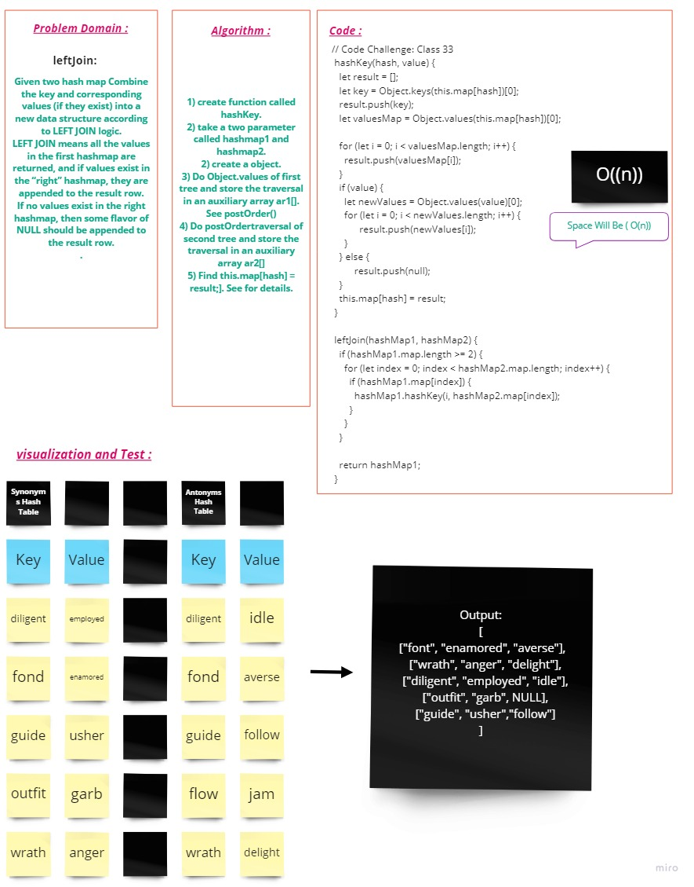

# **Hash Table**
Hash Tables are a data structure that allow you to create a list of paired values. You can then retrieve a certain value by using the key for that value, which you put into the table beforehand.

   - **Object:** An object contains the hash table in which the data is stored. It holds all the “key-value” pairs of the hash table. Also, its size should be determined by the size of expected data.
   - **Hash Function:** A Hash Function is defined for a hash table to find out the “index” of the given key-value pair. This function accepts a **“key”** as an input and then assigns a specific “index” and sets that as the return case.

---

## **Challenge**

##### Map objects are collections of key-value pairs. A key in the Map may only occur once; it is unique in the Map's collection. A Map object is iterated by key-value pairs — a for...of loop returns a 2-member array of [key, value] for each iteration. Iteration happens in insertion order, which corresponds to the order in which each key-value pair was first inserted into the map by the set() method (that is, there wasn't a key with the same value already in the map when set() was called).

##### The specification requires maps to be implemented "that, on average, provide access times that are sublinear on the number of elements in the collection". Therefore, it could be represented internally as a hash table (with O(1) lookup), a search tree (with O(log(N)) lookup), or any other data structure, as long as the complexity is better than O(N).

---

## **Approach & Efficiency**

- Big O for **hash** is O(1) and space O(1) 
- Big O for **set** is O(1) and space O(1) 
- Big O for **get** is O(n) and space O(1)
- Big O for **contains** is O(n) and space O(1)
- Big O for **keys** is O(n) and space O(n)
- Big O for **repeatedWord** is O(n) and space O(n)
- Big O for **lefJoin** is O(n) and space O(n)
    ### Whitebord for **leftJoin**
   

## **Tests**
**✓** Setting a key/value to your hashtable results in the value being in the data structure 

**✓** Successfully handle a collision within the hashtable && return the true or false depend on contain the key or not. 

**✓** Successfully returns value for a key that exist in the hashtable

**✓** Successfully returns null for a key that does not exist in the hashtable

**✓** Successfully returns a list of all unique keys that exist in the hashtable

**✓** Successfully returns a first repeated word in inputs

---

## **API**

   - set
      -  Arguments: key, value
      -  Returns: nothing
      -  This method should hash the key, and set the key and value pair in the table, handling collisions as needed.
      -  Should a given key already exist, replace its value from the value argument given to this method.
   - get
      -  Arguments: key
      -  Returns: Value associated with that key in the table
   - contains
      -  Arguments: key
      -  Returns: Boolean, indicating if the key exists in the table already.
   - keys
      -  Returns: Collection of keys
   - hash
      -  Arguments: key
      -  Returns: Index in the collection for that key
   - repeatedWord
      -  Arguments: string
      -  Returns: string 
   - leftJoin
      -  Arguments: two hash maps (hashMap1, hashMap2)
         - The first parameter is a hashmap that has word strings as keys, and a synonym of the key as values.
         -  The second parameter is a hashmap that has word strings as keys, and antonyms of the key as values.
      -  Returns: The returned data structure that holds the results is up to you. It doesn’t need to exactly match the output below, so long as it achieves the LEFT JOIN logic   

