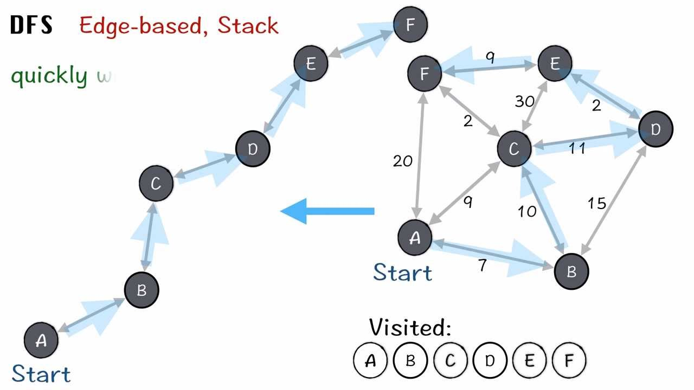
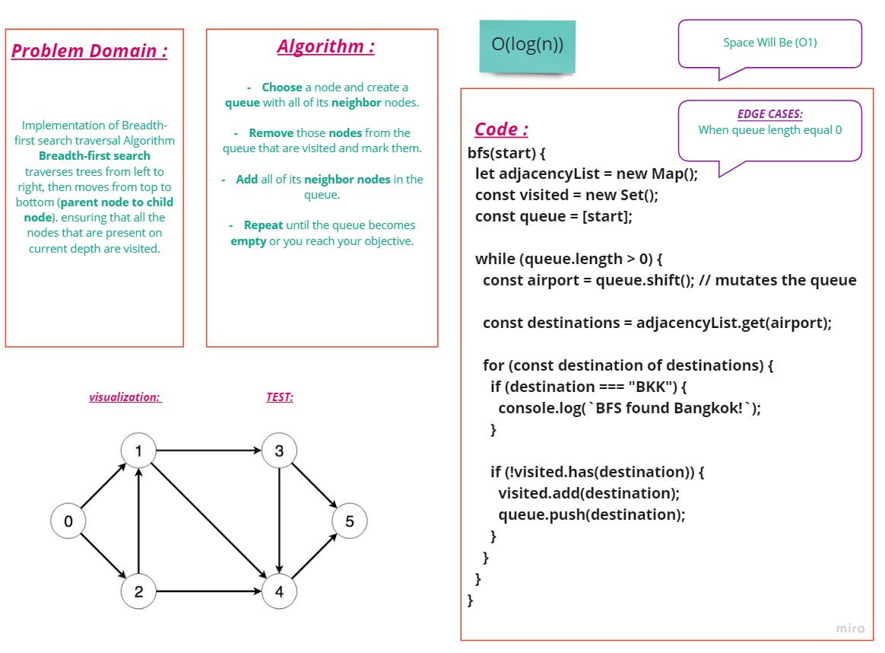

# **Graphs**
A Graph is a non-linear data structure consisting of vertices and edges. The vertices are sometimes also referred to as nodes and the edges are lines or arcs that connect any two nodes in the graph. More formally a Graph is composed of a set of vertices( V ) and a set of edges( E ). The graph is denoted by G(E, V).

## **Breadth-first search (BFS)**
Breadth-first search is a traversing algorithm that is used  for searching or traversing the tree or graph data structure layer by layer. Before moving on to the children node of the next depth level, it visits each node that exists at the current depth..

---

## **Challenge**

### Implementation of Breadth-first search traversal AlgorithmBreadth-first search traverses trees from left to right, then moves from top to bottom (parent node to child node). ensuring that all the nodes that are present on current depth are visited.

---

## **Approach & Efficiency**

- Big O for **BFS** is O(log(n)) and space O(n)
    ### Whitebord for **BFS**
   

---

## **API**

   - bfs
      -  Arguments: start
      -  Returns: traversal Tree
      -  Implementation of Breadth-first search traversal AlgorithmBreadth-first search traverses trees from left to right, then moves from top to bottom (parent node to child node). ensuring that all the nodes that are present on current depth are visited.
