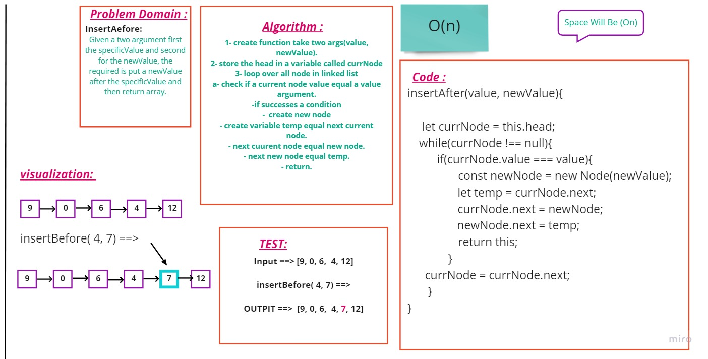
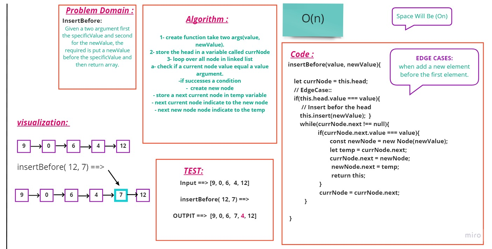
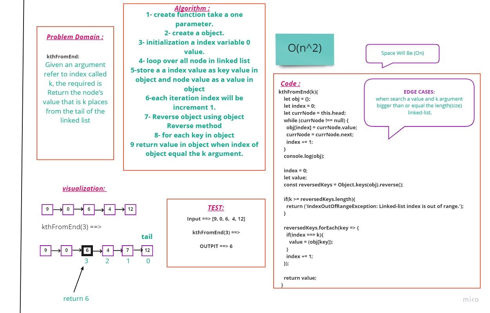
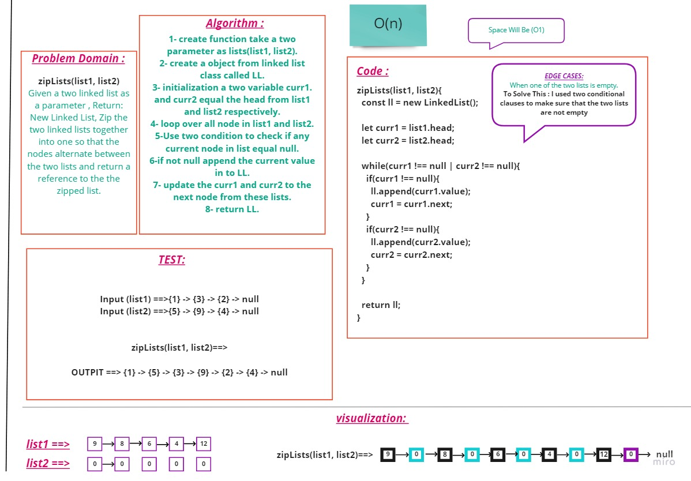

# Singly Linked List

Linked List is a linear data structure made of a sequence of Nodes that are linked to each other. Each Node are linked together by the reference field.

---

## Challenge

Write a method for the Linked List class which takes a value and add it to End Of linked list and another method takes a value and add it to First linked list, and another method takes a value and Check if a Value send exists as a Node’s value somewhere within the list, and methods taka a value and newValue and add newValue Befor and After the specific value and handle all case in two method whin add a newValue in the beginning or ending the list and display the results all node on console.

---

## Approach & Efficiency

- Big O for Append is O(n) and space O(1) 
- Big O for Insert is O(1) and space O(1) 
- Big O for Includes is O(n) and space O(1)
- Big O for **InsertAfter** is O(n) and space O(1)
 
- Big O for **InsertBefore** is O(n) and space O(1)
 
- Big O for **kthFromEnd** is O(n^2) and space O(n)

- Big O for **zipLists** is O(n) and space O(1)
 

---

## API

- insert : To Insert a new Node To The Head of Linked List.

- includes : To Check if a Value send exists as a Node’s value somewhere within the list.

- toString : Return String representing all the values in the Linked List.

- insertBefore :  Return the array after Insert the newValue After the specific value.

- insertAfter : Return the array after Insert the newValue Be the specific value.

---

[Home Page](../README.md)

---