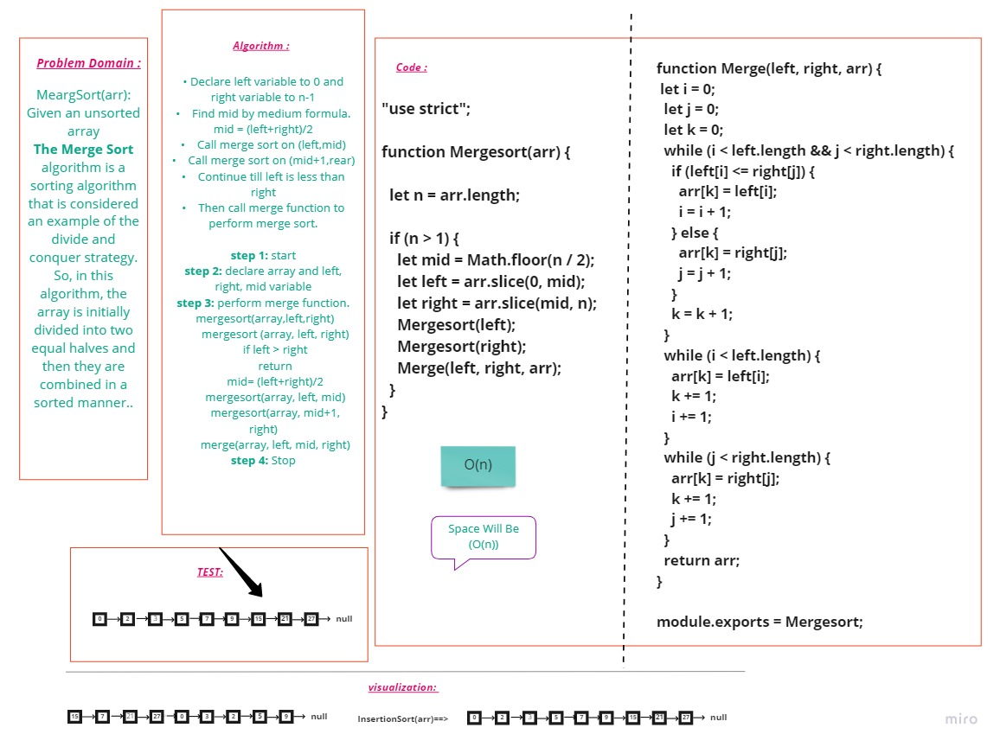

# **Sorting**

## **Merge Sort:**

The Merge Sort algorithm is a sorting algorithm that is considered an example of the divide and conquer strategy. So, in this algorithm, the array is initially divided into two equal halves and then they are combined in a sorted manner. We can think of it as a recursive algorithm that continuously splits the array in half until it cannot be further divided. This means that if the array becomes empty or has only one element left, the dividing will stop, i.e. it is the base case to stop the recursion. If the array has multiple elements, we split the array into halves and recursively invoke the merge sort on each of the halves. Finally, when both the halves are sorted, the merge operation is applied. Merge operation is the process of taking two smaller sorted arrays and combining them to eventually make a larger one..

</br></br>

## **Whiteboard**



## **Code :**
```js
"use strict";

function Mergesort(arr) {

  let n = arr.length;

  if (n > 1) {
    let mid = Math.floor(n / 2);
    let left = arr.slice(0, mid);
    let right = arr.slice(mid, n);
    Mergesort(left);
    Mergesort(right);
    Merge(left, right, arr);
  }
}


function Merge(left, right, arr) {
  let i = 0;
  let j = 0;
  let k = 0;
  while (i < left.length && j < right.length) {
    if (left[i] <= right[j]) {
      arr[k] = left[i];
      i = i + 1;
    } else {
      arr[k] = right[j];
      j = j + 1;
    }
    k = k + 1;
  }
  while (i < left.length) {
    arr[k] = left[i];
    k += 1;
    i += 1;
  }
  while (j < right.length) {
    arr[k] = right[j];
    k += 1;
    j += 1;
  }
  return arr;
}

module.exports = Mergesort;

```
---
## **Trace :**
   - At first, check if the left index of array is less than the right index, if yes then calculate its mid point
   
   
   - Now, as we already know that merge sort first divides the whole array iteratively into equal halves, unless the atomic values are achieved. 
   - Here, we see that an array of 7 items is divided into two arrays of size 4 and 3 respectively.
   
      
   
   - Now, again find that is left index is less than the right index for both arrays, if found yes, then again calculate mid points for both the arrays.

      

   - Now, further divide these two arrays into further halves, until the atomic units of the array is reached and further division is not possible.

       

   - After dividing the array into smallest units, start merging the elements again based on comparison of size of elements
   - Firstly, compare the element for each list and then combine them into another list in a sorted manner.

      

   - After the final merging, the list looks like this:

      

---
</br></br>

## **Approach & Efficiency**

- Big O for **Merge Sort** is O(n)

</br></br>
