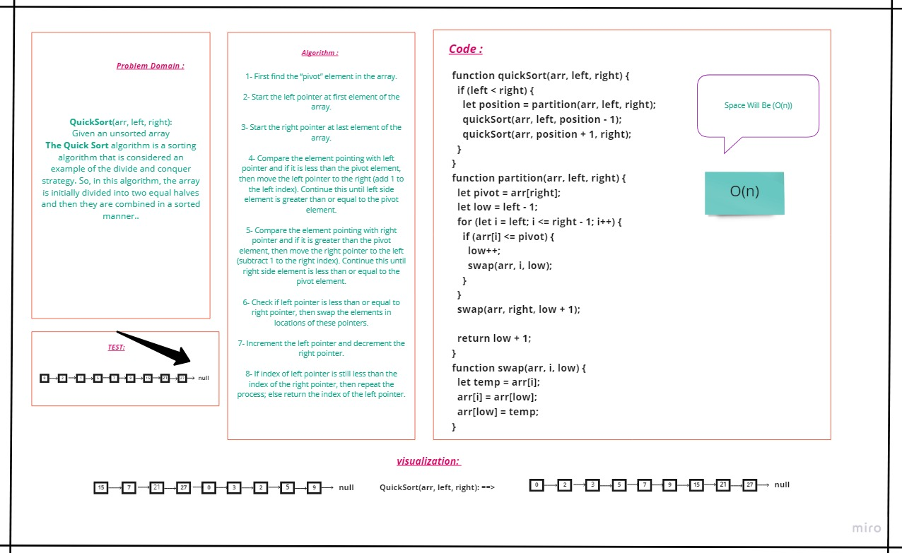
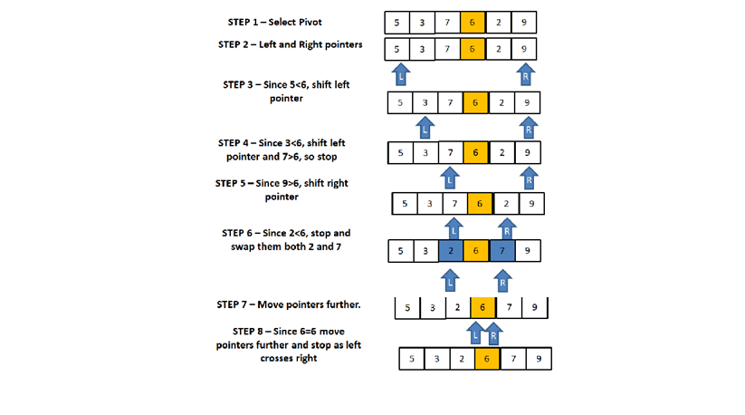

# **Sorting**

## **Quick Sort:**
Quick Sort algorithm follows Divide and Conquer approach. It divides elements into smaller parts based on some condition and performing the sort operations on those divided smaller parts.

Quick Sort algorithm is one of the most used and popular algorithms in any programming language. But, if you are a JavaScript developer, then you might of heard of sort() which is already available in JavaScript. Then, you might have been thinking what the need of this Quick Sort algorithm is. To understand this, first we need what is sorting and what is the default sorting in JavaScript.

</br></br>

## **Whiteboard**



## **Code :**
```js
'use strict';

function quickSort(arr, left, right) {
  if (left < right) {
    let position = partition(arr, left, right);
    quickSort(arr, left, position - 1);
    quickSort(arr, position + 1, right);
  }
}
function partition(arr, left, right) {
  let pivot = arr[right];
  let low = left - 1;
  for (let i = left; i <= right - 1; i++) {
    if (arr[i] <= pivot) {
      low++;
      swap(arr, i, low);
    }
  }
  swap(arr, right, low + 1);

  return low + 1;
}
function swap(arr, i, low) {
  let temp = arr[i];
  arr[i] = arr[low];
  arr[low] = temp;
}


module.exports = quickSort;
```
---
## **Trace :**
   1- First find the “pivot” element in the array.

   2- Start the left pointer at first element of the array.

   3- Start the right pointer at last element of the array.

   4- Compare the element pointing with left pointer and if it is less than the pivot element, then move the left pointer to the right (add 1 to the left index). Continue this until left side element is greater than or equal to the pivot element.

   5- Compare the element pointing with right pointer and if it is greater than the pivot element, then move the right pointer to the left (subtract 1 to the right index). Continue this until right side element is less than or equal to the pivot element.

   6- Check if left pointer is less than or equal to right pointer, then swap the elements in locations of these pointers.

   7- Increment the left pointer and decrement the right pointer.

   8- If index of left pointer is still less than the index of the right pointer, then repeat the process; else return the index of the left pointer.

   

---
</br></br>

## **Approach & Efficiency**

- Big O for **Quick Sort** is O(n)

</br></br>
