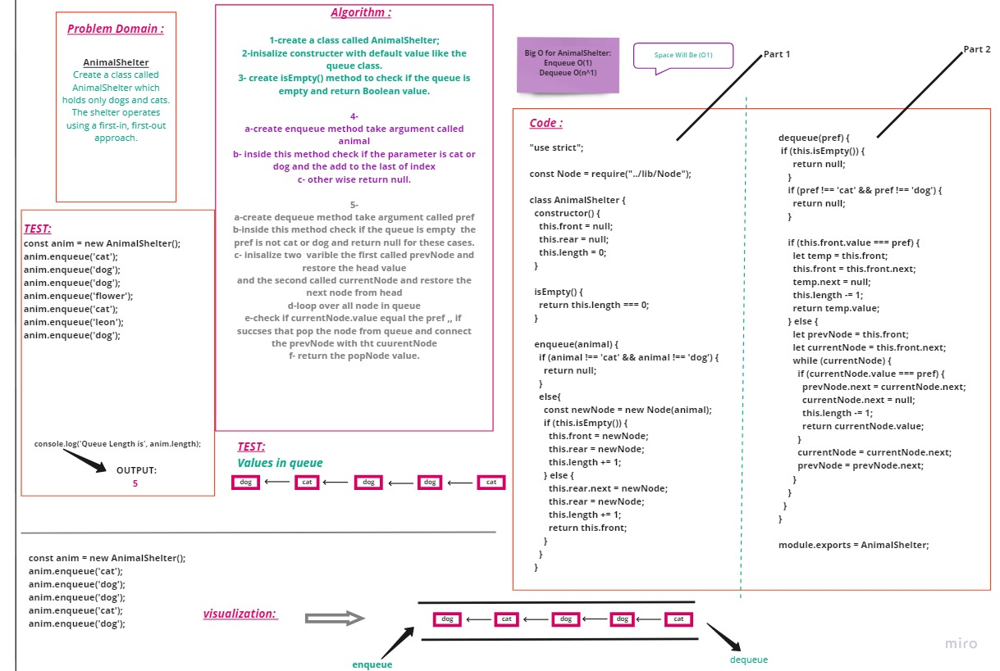

# **Stacks and Queues**
**Stacks:**
A stack is a data structure that consists of Nodes. Each Node references the next Node in the stack, but does not reference its previous, in stacks last in first out.

**Queues:**
represents a first-in, first out collection of object. It is used when you need a first-in, first-out access of items. When you add an item in the list, it is called enqueue, and when you remove an item, it is called dequeue .

## **Challenge:**
Using a Linked List as the underlying data storage mechanism, implement both a Stack and a Queue.

## **Approach & Efficiency:**
1. Big O for **stack**:
    - Push O(1)
    - Pop O(1)
    - Peek O(1)
    - IsEmpty O(1)
2. Big O for **Queue**:
    - Enqueue O(1)
    - Dequeue O(1)
    - Peek    O(1)
    - IsEmpty O(1)
3. Big O for **PseudoQueue**:
    - Enqueue O(n^2)
    - Dequeue O(1)
4. Big O for **AnimalShelter**:
    - Enqueue O(1)
    - Dequeue O(n^1)
## **Whiteboard for AnimalShelter**
    

## **API:**

- Push: for insert new node 
- Pop: for delete a node from my linked list
- Peek: It is show me the last node add it to linked list
- IsEmpty: TO check if there is node in the linked list
  
- Enqueue:for insert new node
- Dequeue:for delete a node from my linked list
- Peek:  It is show me the last node add it to linked list
- IsEmpty: TO check if there is node in the linked list
