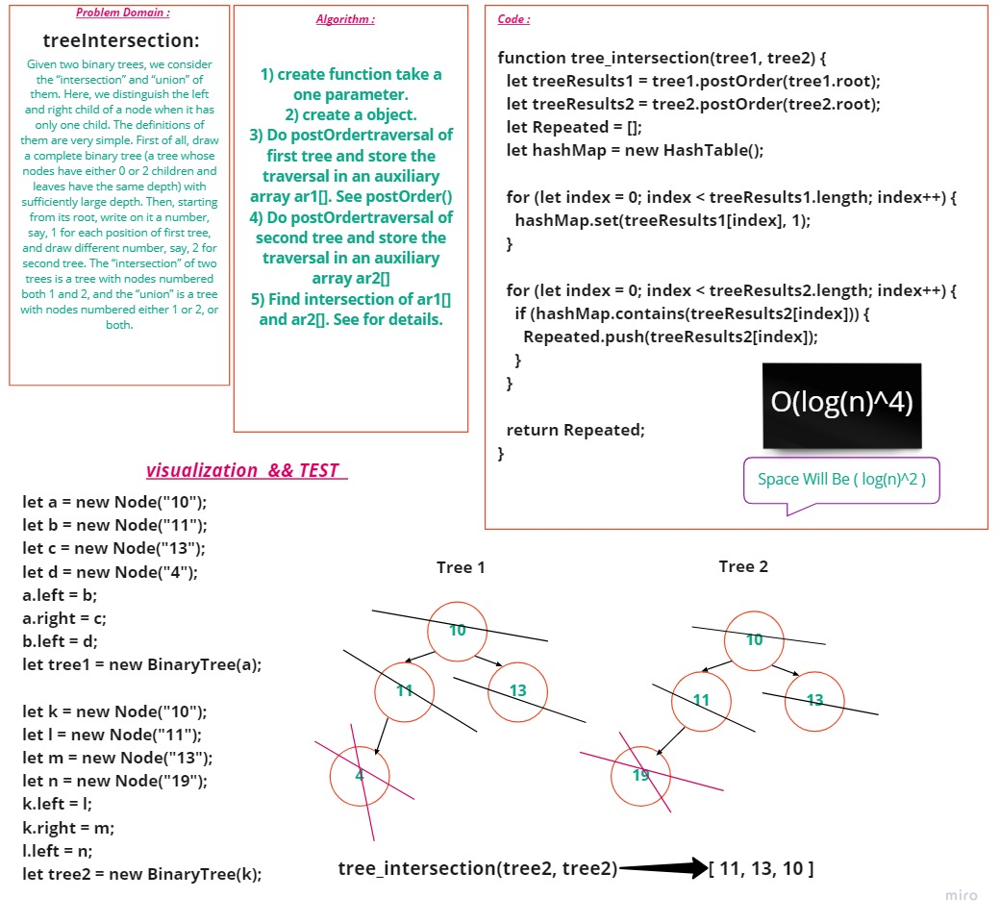

# **Tree Intersection**
Given two binary trees, we consider the “intersection” and “union” of them. Here, we distinguish the left and right child of a node when it has only one child. The definitions of them are very simple. First of all, draw a complete binary tree (a tree whose nodes have either 0 or 2 children and leaves have the same depth) with sufficiently large depth. Then, starting from its root, write on it a number, say, 1 for each position of first tree, and draw different number, say, 2 for second tree. The “intersection” of two trees is a tree with nodes numbered both 1 and 2, and the “union” is a tree with nodes numbered either 1 or 2, or both.

---

## **Challenge**

##### Write a function called tree_intersection that takes two binary trees as parameters.Using your Hashmap implementation as a part of your algorithm, return a set of values found in both trees.

---

## **Approach & Efficiency**

- Big O for **tree_intersection** is O( **log(n)^4** ) and space O( **log(n)^2** )
# **Whiteboard :**

## **Tests**
**✓** Check return Repeated values.

**✓** Check returns a list for all Repeated values. 

---

## **API**

   - tree_intersection
      -  Arguments: tree1, tree2
      -  Returns: Repeated
         -  Write a function called tree_intersection that takes two binary trees as parameters.
         - Using your Hashmap implementation as a part of your algorithm, return a set of values found in both trees.
   