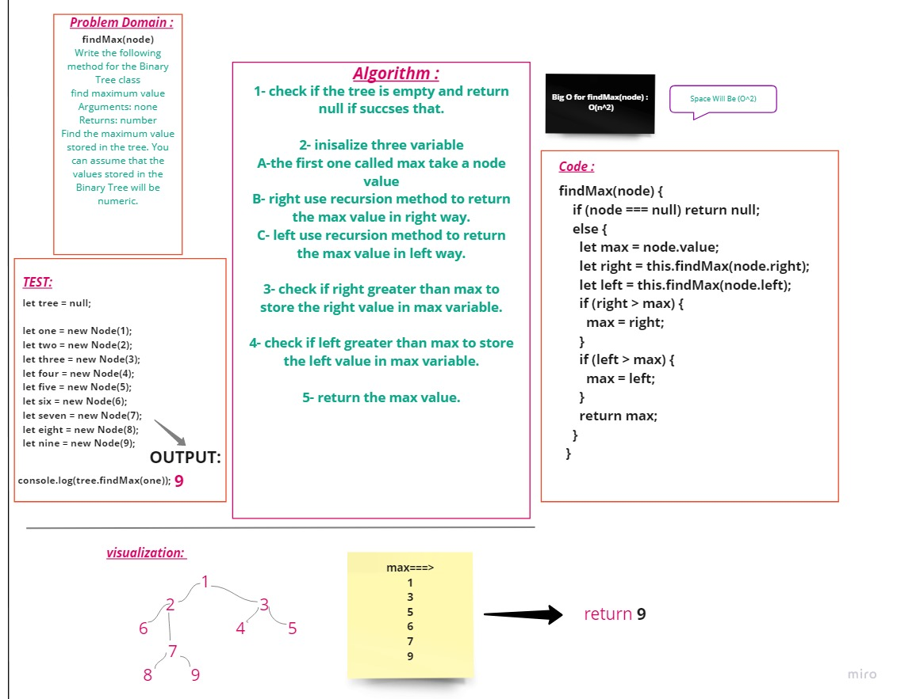

# **Trees**
**Binary Tree:**
A binary tree is a tree data structure composed of nodes, each of which has at most, two children, referred to as left and right nodes. The tree starts off with a single node known as the root..

**Binary Search Tree:**
Binary Search Tree is a node-based binary tree data structure which has the following properties:
- The left subtree of a node contains only nodes with keys lesser than the node’s key.
- The right subtree of a node contains only nodes with keys greater than the node’s key.
- The left and right subtree each must also be a binary search tree..

  

## **Challenge**

Using a Trees as the underlying data storage mechanism, implement tree and binary tree.

  

## **Approach & Efficiency**

- Big O for **preOrder** is O(n)

- Big O for **inOrder** is O(n)

- Big O for **postOrder** is O(n)

- Big O for **Add** is O(n)

- Big O for **Contains** is  O(log n)

---

- Big O for **findMax** is  O(log n)
- Space for **findMax** is O(n^2)

  

## **API**
- preorder function : to oreder our node in the tree like root-left-right

- inorder function : to oreder our node in the tree like left-root-right

- postorder function :  to oreder our node in the tree like left-right-root

- Add function : to add new node to our tree

- search function : to search about a value in our tree 
